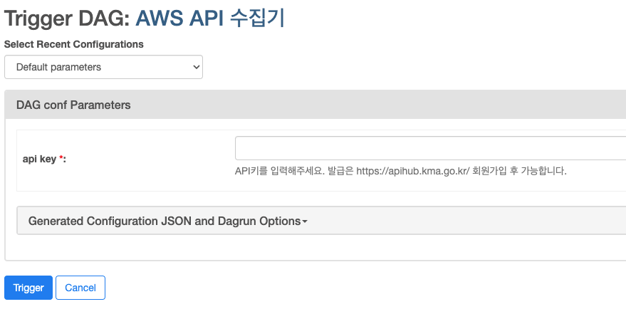
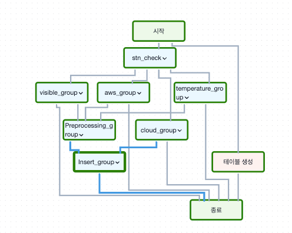

# Airflow kma 기상청 api aws 수집

## Description.
1. stn_check 부분은 선행으로 먼저 데이터베이스에 넣어주셔야합니다.
2. 수집은 AWS, 운량, 시정자료, 온도자료 총 4가지를 수집합니다.
3. https://apihub.kma.go.kr/ 해당 사이트를 가입 후 api를 발급 받아야합니다.

##  트리거 화면

## Flow chart

## 개선점 및 문제점
connection을 param에 넣어서 유동적으로 넣을수 있도록 함

데이터베이스 삽입코드에 중복처리는 있긴하지만, Celery를 도입하여 중복 실행을 막아야함.

아쉽게도 지점번호는 동적으로 넣을 수 없음. (직접 수정해야함)

스케줄러 시 파라미터는 고정해야 함.