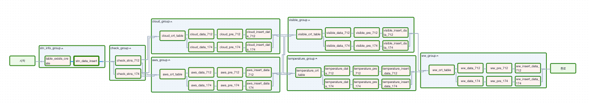

# Airflow kma 기상청 api aws 수집

## Description.
1. stn_check 부분은 선행으로 먼저 데이터베이스에 넣어주셔야합니다.
2. 수집은 AWS, 운량, 시정자료, 온도자료 총 4가지를 수집합니다.
3. https://apihub.kma.go.kr/ 해당 사이트를 가입 후 api를 발급 받아야합니다.

##  트리거 화면
### 구버전

### 신버전

------

## Flow chart
### 구버전

### 신버전

------

## 개선점 및 문제점
connection을 param에 넣어서 유동적으로 넣을수 있도록 함 (conn_id 지정 완료)

데이터베이스 삽입코드에 중복처리는 있긴하지만, Celery를 도입하여 중복 실행을 막아야함. (Celery 도입)

아쉽게도 지점번호는 동적으로 넣을 수 없음. (직접 수정해야함)

스케줄러 시 파라미터는 고정해야 함.

airflow에서 지원하는 도커파일은 기본적으로 celery execute지만 worker를 여러개 만들 경우 수정이 약간 필요함.

- web server의 secret키를 적용하여 log를 볼 수 있게 해야함
- 무작정 워커를 늘리기만 하면 구동이 안 될 수 있음
- AIRFLOW__CORE__STORE_DAG_CODE: 'True' 과 AIRFLOW__CORE__STORE_SERIALIZED_DAGS: 'True' 2.0에서 지원하지만 작동이 안되서 직접 dags폴더를 worker들에게 마운트해야함

한번에 많은 api를 수집 시 무작위로 한 곳에서 failed가 생김. 이를 해결하기 위해선 한번에 수행하는 양을 줄이며 연속적으로 수행하는 거임

**현재 dag는 현재시간을 기준으로 하며, catchup을 True로 하여도 지나간 데이터는 수집하지 않음**

## Flower

## 도커 파일 사용 방법
1. flower 구동
docker compose --profile flower up -d
2. 도커 종료
docker compose --profile flower down
3. flower 미 구동
docker compose up -d
2. 도커 종료
docker compose down
